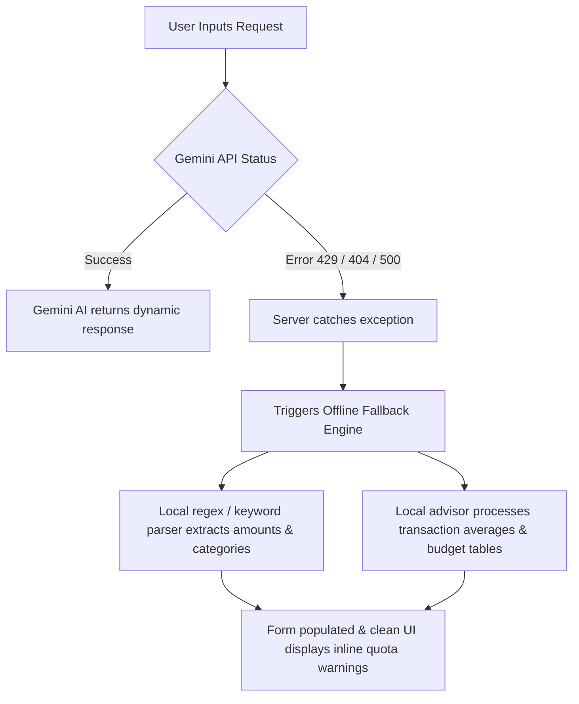

# 🪙 My Wallet — Premium Minimalist Finance Hub

My Wallet is a modern, personal finance tracker and intelligent conversational ledger assistant. It is built using **Next.js 14 (App Router)**, **NextAuth**, **Supabase PostgreSQL**, and the **Google Gemini API** (using the stable `v1` endpoint and `gemini-2.0-flash` model).

The application features a striking **Stark Neobrutalist design system** characterized by high-contrast borders, thick offset shadows, responsive layouts, and a dedicated mobile bottom navigation bar.

---

## 🚀 Key Features

### 📊 Real-Time Financial Dashboard
*   **Ledger Stats**: Live indicators showing Total Income, Total Expenses, Net Savings, and Net Worth.
*   **Visual Analytics**: Interactive Recharts-based breakdown representing income vs. expenses and category distribution.
*   **Multi-Wallet Ledger**: Manage balances across multiple payment accounts (Cash, Bank Account, Credit Card).

### 🤖 Intelligent AI Helpers (Gemini-Powered)
*   **Quick AI Add**: Enter natural language commands (e.g. *"spent ₹250 on pizza from bank yesterday"*) to instantly populate transaction type, amount, category, date, and wallet.
*   **OCR Receipt Scanner**: Upload receipt images; the AI vision model parses the total amount, merchant name, date, and items to fill the entry form automatically.
*   **Conversational Assistant Workspace**: A dedicated chat space to ask questions about your ledger (e.g. *"How much did I spend on dining this week?"* or *"What is my budget compliance?"*).

### ⚡ Resilient Offline Fallback Engines
*   **Offline Parser**: If your Gemini API key hits Google rate limits (`429 Resource Exhausted` / `limit: 0`), the backend catches the error and executes a local regex keyword parser to auto-fill the transaction.
*   **Offline Chat Advisor**: If the chat API fails, it catches the exception and launches a local rules-based ledger compiler to calculate exact financial breakdowns and budget status tables from your actual transactions.

### 🔒 Secure Authentication & Data Syncing
*   **OAuth Logins**: Seamless Google Sign-In and Credentials registry handled via NextAuth.
*   **Automatic Syncing**: Local-first architecture allows you to track finances offline via `localStorage`. When you sign in, the app automatically uploads and maps your offline transactions to the Supabase cloud database.

---

## 🛠️ Technology Stack

*   **Core Framework**: Next.js 14.2.15 (App Router, Server Actions, & API Routes)
*   **Database Adapter**: `@supabase/supabase-js` (PostgreSQL client)
*   **Auth Client**: NextAuth.js (v4 catching credentials & provider callback configurations)
*   **AI SDK**: Native Fetch queries to Google's stable Generative Language REST v1 API (`gemini-2.0-flash`)
*   **Styling**: Tailwind CSS configured with a Stark Neobrutalist theme (Black & White aesthetics, rigid borders, micro-interactions, responsive bottom navigation dock for mobile devices)
*   **Icons**: Lucide React

---

## 📁 Directory Structure

```text
My-Wallet/
├── app/                       # Next.js App Router Pages
│   ├── api/                   # Serverless Backend Endpoints
│   │   ├── auth/              # Credentials register & NextAuth routes
│   │   ├── parse-transaction/ # Natural language parser endpoint
│   │   ├── scan-receipt/      # Vision OCR receipt parser endpoint
│   │   └── wallet-chat/       # Conversational AI assistant endpoint
│   ├── budgets/               # Budget monitoring and compliance page
│   ├── chat/                  # Dedicated financial chatbot workspace
│   ├── subscriptions/         # Recurring schedules & bills manager
│   ├── transactions/          # Transaction ledger filtering & search page
│   ├── layout.js              # Root Layout, font setups, and viewport config
│   └── page.js                # Main Dashboard View
├── components/                # Reusable UI Components
│   ├── ui/                    # Base interactive primitives (Select, Input, etc.)
│   ├── AccountsCard.jsx       # Multi-wallet balance card
│   ├── AuthModal.jsx          # Register / Sign In modal
│   ├── BudgetPlanner.jsx      # Adaptive category progress bars
│   ├── FinancialCharts.jsx    # Dashboard Recharts visuals
│   ├── Navbar.jsx             # Top branding nav & responsive mobile bottom dock
│   └── TransactionForm.jsx    # Quick AI Add & Manual entry form
├── lib/                       # Utility Modules & State Contexts
│   ├── schema.sql             # SQL Database migration commands
│   ├── supabase.js            # Supabase API client & sanitizers
│   └── WalletContext.jsx      # NextAuth state, local storage fallbacks, & data syncs
├── public/                    # Static Assets (favicon, service worker)
└── scratch/                   # DB and Gemini connection test scripts
```

---

## ⚙️ Environment Configuration

Create a `.env.local` file in the root directory. Copy and fill in the following parameters:

```env
# 1. Supabase PostgreSQL Configuration
NEXT_PUBLIC_SUPABASE_URL="https://your-project-id.supabase.co"
NEXT_PUBLIC_SUPABASE_ANON_KEY="your-anon-key-here"

# 2. Google Gemini API Configuration (for AI Parsing & Chat)
GEMINI_API_KEY="AIzaSy..."

# 3. NextAuth Configuration (for Authentication & Session)
NEXTAUTH_URL="http://localhost:3000"
# Generate a secret via terminal: node -e "console.log(crypto.randomBytes(32).toString('base64'))"
AUTH_SECRET="your-32-byte-secret-base64-here"

# 4. Google OAuth Credentials (for Google Sign-In)
AUTH_GOOGLE_ID="your-google-oauth-client-id.apps.googleusercontent.com"
AUTH_GOOGLE_SECRET="your-google-oauth-client-secret"
```

---

## 🛠️ Installation & Setup

1.  **Clone the Repository** and navigate to the project directory:
    ```bash
    cd My-Wallet
    ```
2.  **Install dependencies**:
    ```bash
    npm install
    ```
3.  **Set Up the Database**:
    *   Log in to your [Supabase Console](https://supabase.com/).
    *   Navigate to your SQL Editor and execute the script inside [lib/schema.sql](file:///d:/Documents/Code/Projects/mywallet/My-Wallet/lib/schema.sql) to create the tables (`users`, `accounts`, `transactions`, `budgets`, `recurring_rules`) and set up the corresponding foreign key relations.
4.  **Launch the Development Server**:
    ```bash
    npm run dev
    ```
5.  Open **`http://localhost:3000`** in your browser to view the application.

---

## 🧩 Offline Fallback Architecture

To protect you against API quota exhaustions and key limits (Google's `429 Limit: 0` error), the application has built-in redundancy:


This defensive design ensures that **the core features of your app remain fully operational**, even if the Google Gemini backend is unreachable.
